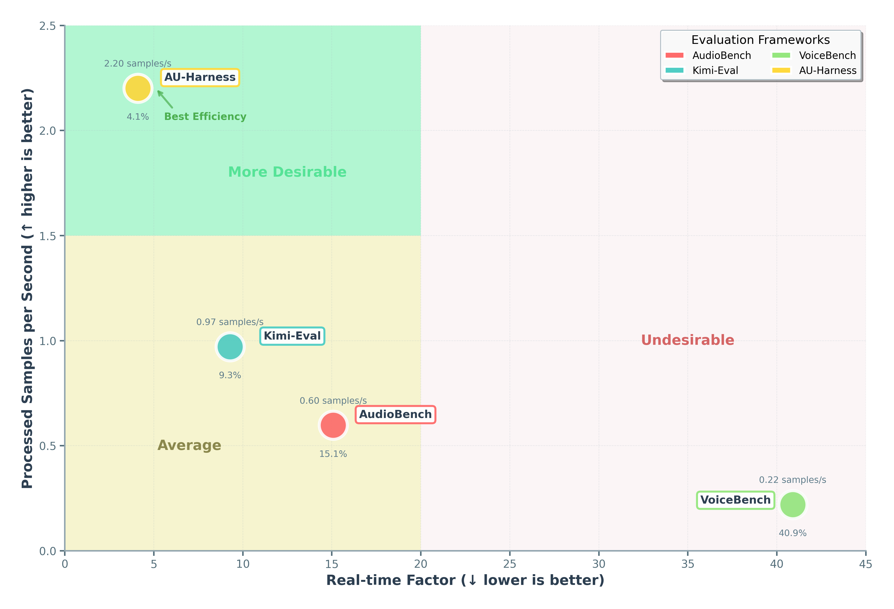

<div align="center" style="margin-bottom: 1em;">

# AU-Harness: An Open-Source Toolkit for Holistic Evaluation of Audio LLMs

*Comprehensive • Fast • Reproducible*


[](https://arxiv.org/abs/2509.08031)
[](https://au-harness.github.io/)
[](https://www.python.org/downloads/)
[](https://opensource.org/licenses/Apache-2.0)
[](https://github.com/ServiceNow/AU-Harness)
[](https://github.com/ServiceNow/AU-Harness/pulls)

**🎯 50+ Datasets • 🚀 380+ Subsets • 📊 9 Metrics • 🔊 21 Audio Tasks**

</div>

## 📋 Overview

AU-Harness is a standardized, efficient and highly customizable open-source framework for evaluating audio-based language models on Audio-to-Text tasks. Built for researchers and developers, AU-Harness provides a comprehensive suite of tools to benchmark and compare the performance of various audio processing models across a wide range of tasks.


## ❓ Why AU-Harness?

1. 🚀 **Blazing Fast**:
   - Multiple models can be evaluated simultaneously across multiple tasks, datasets and metrics using independent Engines, enabling full parallelization of the evaluation pipeline
   - Model inference and evaluation is batched, with the only bottleneck being user-set batch size
   - Dataset Sharding is implemented for linearly scalable inference throughput

<p align='center'>
  
</p>

2. 🔧 **Immensely Customizable**:
   - Dataset and Samples can be customized and filtred by accents, language, length, and more
   - Models and tasks can be customized by temperature, request parameters, prompts and batch size
   - Score reporting can be customized through the aggregation parameter

3. 📦 **Super Modular**:
   - Streamlined evaluation processes allow for better understanding of the codebase
   - Modularized functions allow for easy extension and customization

4. 🎯 **Wide Task Coverage**:
   - We support 21 unique tasks over 6 different categories
   - Over 50 unique datasets, with 380+ unique subsets
   - 9 different metrics for broader evaluation coverage


## 📊 Task Taxonomy & Structure

<div align="center" style="margin: 30px 0;">
  
</div>

### 📁 Task Organization

<details>
<summary><b>🗣️ <a href="./tasks/speech_recognition/README.md"> Speech Recognition </a></b> <i>(3 tasks)</i></summary>

- [**asr**](./tasks/speech_recognition/asr/) - Automatic speech recognition
  - *Datasets: librispeech, voxpopuli, common voice, and more*
- [**code_switching_asr**](./tasks/speech_recognition/code_switching_asr/) - Transcribe utterances with mixed-language speech.
- [**long_form_asr**](./tasks/speech_recognition/long_form_asr/) - Transcribe extended audio content

</details>

<details>
<summary><b>🎭 <a href="./tasks/paralinguistics/README.md"> Paralinguistics </a></b> <i>(5 tasks)</i></summary>

- [**emotion_recognition**](./tasks/paralinguistics/emotion_recognition/) - Detect emotional states from speech
- [**accent_recognition**](./tasks/paralinguistics/accent_recognition/) - Identify speaker accents and dialects
- [**gender_recognition**](./tasks/paralinguistics/gender_recognition/) - Classify speaker gender from voice
- [**speaker_recognition**](./tasks/paralinguistics/speaker_recognition/) - Identify speaker(s) present in the audio.
- [**speaker_diarization**](./tasks/paralinguistics/speaker_diarization/) - Segment speech into audio segments attributed to different speakers

</details>

<details>
<summary><b>🔊 <a href="./tasks/audio_understanding/README.md"> Audio Understanding </a></b> <i>(2 tasks)</i></summary>

- [**music_understanding**](./tasks/audio_understanding/music_understanding/) - Analyze and understand musical content
- [**scene_understanding**](./tasks/audio_understanding/scene_understanding/) - Identify and classify audio scenes based on the ambient sound information.

</details>

<details>
<summary><b>🧠 <a href="./tasks/spoken_language_understanding/README.md"> Spoken Language Understanding </a> </b> <i>(5 tasks)</i></summary>

- [**intent_classification**](./tasks/spoken_language_understanding/intent_classification/) - Classify user intents from spoken inputs
- [**speech_qa**](./tasks/spoken_language_understanding/speech_qa/) - Answer questions based on spoken content
- [**sqqa**](./tasks/spoken_language_understanding/sqqa/) - Spoken query question-answering with context
- [**spoken_dialogue_summarization**](./tasks/spoken_language_understanding/spoken_dialogue_summarization/) - Summarize spoken conversations
- [**translation**](./tasks/spoken_language_understanding/translation/) - Translate given speech into the target language. 

</details>

<details>
<summary><b>🧩 <a href="./tasks/spoken_language_reasoning/README.md"> Spoken Language Reasoning </a></b> <i>(4 tasks)</i></summary>

- [**ifeval**](./tasks/spoken_language_reasoning/ifeval/) - Speech Instruction-following capability evaluation
- [**bfcl**](./tasks/spoken_language_reasoning/bfcl) - Speech Function Calling capability evaluation
- [**mtbench**](./tasks/spoken_language_reasoning/mtbench/) - Complex multi-turn Instruction-following capability evaluation
- [**speech_to_sql**](./tasks/spoken_language_reasoning/speech_to_sql/) - Speech-to-Coding capability

</details>

<details>
<summary><b>🔐 <a href="./tasks/safety_and_security/README.md"> Safety and Security </a></b> <i>(2 tasks)</i></summary>

- [**safety**](./tasks/safety_and_security/safety/) - Evaluate model safety and robustness
- [**spooling**](./tasks/safety_and_security/spoofing/) - Detect synthetic or manipulated audio

</details>

## 🏗️ Architecture

### General Evaluation Flow

<p align='center'>
  
</p>
The evaluation flow in AU-Harness follows a highly concurrent architecture:

1. **Configuration & Initialization**: The system parses `config.yaml` to load models, datasets, metrics, and other evaluation parameters.

2. **Engine Assembly**: For each dataset-metric pair, an Engine is created containing:
   - A dataset
   - A preprocesser
   - The specified metric
   - An appropriate postprocessor
   - References to all specified models

3. **Concurrent Execution**: 
   - All Engines run simultaneously
   - Within each Engine, model inference occurs concurrently across all models
   - After inference completes, the postprocessor transforms model outputs
   - Evaluation is performed concurrently, with record-level scores logged throughout

4. **Results Aggregation**: The main process awaits completion of all Engines before compiling and reporting final performance metrics.

This architecture enables efficient scaling with multiple models and datasets while maintaining organized evaluation workflows.

## 🚀 Quick Start

Get up and running in under a minute:

```bash
# Clone and install
git clone https://github.com/ServiceNow/AU-Harness.git
cd AU-Harness
pip install -r requirements.txt

# Run your first evaluation
cp sample_config.yaml config.yaml
bash evaluate.sh
```

Results will be generated in `run_logs/` with detailed metrics and analysis.

## 💻 Usage

AU-Harness requires setting up a running configuration file (`config.yaml`) to define your evaluation parameters. This file controls which models, datasets, and metrics are used in your evaluation.

To get started with AU-Harness:

1. Clone this repository
2. Setup your environment:
```bash
python -m venv myEnv
source myEnv/bin/activate
pip install -r requirements.txt
```
3. Populate your `config.yaml` file based on the example provided in `sample_config.yaml` and instructions below - the given 'config.yaml' already has the mandatory fields
4. Run the end-to-end evaluation:
```bash
bash evaluate.sh

```
**NOTE:** If you would like to run evaluation with your own customized config, use the command below. Sample customized running configurations are provided in [run_configs](./run_configs/) 
```
bash evaluate.sh --config /path/to/your/config.yaml
```

### 🧩 Running Configuration Options

The `config.yaml` file supports the following customization options. Sample running configurations are available for reference at [sample_config.yaml](./sample_config.yaml).

#### Dataset and Metrics
```yaml
dataset_metric:
  - ["librispeech_test_other", "word_error_rate"] #evaluate by dataset
  - ["emotion_recognition", "llm_judge_binary"] # evaluate by task group
  - ["spoken_language_understanding", "all"] # evaluate all metrics of all tasks in group
```

#### Sampling and Filtering
```yaml
filter:
  num_samples: 300 # optional - number of samples to run(remove for all)
  length_filter: [1.0, 30.0] # optional - filters for only audio samples in this length(seconds)
```

#### Result Aggregation
```yaml
# Optional - allows for custom score aggregation at the end. Currently only simple average is supported
# Follow the format of [x, [y1, y2]] where x is a valid metric, and each y is a valid task or a group (of tasks)
aggregate:
  - ["llm_judge_binary", ["emotion_recognition"]]
  - ["llm_judge_detailed", ["alpaca_audio_test", "openhermes_instruction_test"]]
  - ["word_error_rate", ["librispeech"]]
```

#### Generation parameters override
```yaml
# Generation parameters are generally defined for each task in their task configs
# This can be overriden for specific models and tasks using the following format.
generation_params_override:
  # Task override - Apply for this task for all models
  - task: <TASK1>
    generation_params:
      temperature: <temperature>
      max_gen_tokens: <max_gen_tokens>
  # Model override - Apply for this model for all tasks
  - model: <MODEL1>
    generation_params:
      temperature: <temperature>
      max_gen_tokens: <max_gen_tokens>
  # Model and Task override - Apply for this model and task
  - model: <MODEL1>
    task: <TASK1>
    generation_params:
      temperature: <temperature>
      max_gen_tokens: <max_gen_tokens>
```

#### System and User prompt override
```yaml
# System prompts and user prompts (high level task instructions) can be overriden from the run config
prompt_overrides:
  # User prompt override mandatorily requires a task name because these are generally task specific
  user_prompt:
    - task: <task_name>
      model: <model_name> # (optional)
      prompt: <prompt_text>
  # System prompt override mandatorily requires a model name because these are generally model specific
  system_prompt:
    - model: <model_name>
      task: <task_name> # (optional)
      prompt: <prompt_text>
```

#### Model Configuration
```yaml
models:
  - name: "gpt-4o-mini-audio-preview-1" # Mandatory - must be unique
    inference_type: "openai"  # openai(openai), vllm(vllm), or audio transcription(transcription)
    url: ${ENDPOINT_URL} # Mandatory
    delay: 100 # Optional
    retry_attempts: 8 # Optional
    timeout: 30 # Optional
    model: "gpt-4o-mini-audio-preview" # Mandatory
    auth_token: ${AUTH_TOKEN} # Mandatory
    api_version: ${API_VERSION} # Mandatory
    batch_size: 350 # Mandatory
    chunk_size: 30  # Optional - Max audio length in seconds
    
  - name: "qwen_2.5_omni" # Mandatory
    inference_type: "vllm"  # openai, vllm, or audio transcription
    url: ${ENDPOINT_URL} # Mandatory
    delay: 100 # Optional
    retry_attempts: 8 # Optional
    timeout: 30 # Optional
    model: "qwen_2.5_omni" # Mandatory
    auth_token: ${AUTH_TOKEN} # Mandatory
    batch_size: 150 # Mandatory
    chunk_size: 30  # Optional - Max audio length in seconds
```

**Note**: Batch-size proportional dataset sharding is implemented when multiple endpoints of the same model are provided. Be sure to have unique 'name' attributes for each unique endpoint, as shown above

##### Inference Types

| Client           | Inference Type                       |
|------------------|--------------------------------------|
| "openai"         | AsyncAzureOpenAI (Chat Completions)  |
| "vllm"           | AsyncOpenAI (Chat Completions)       |
| "transcription"  | AsyncOpenAI (Transcriptions)         |

#### Judge Configuration
LLM-Judge setup is required to run any tasks requiring LLM-judge metrics. For specific task-metric pair compatibility, visit [Task Documentation](./tasks/README.md) and [Metric Documentation](./metrics/README.md).
Sample LLM-judge configuration is noted below. We provide [sample run_config](./run_configs/mtbench.yaml) that requires LLM-judge setup accordingly.
```yaml
judge_settings:
  judge_concurrency: 300 # optional - default is 1
  judge_model: "gpt-4o-mini" # mandatory
  judge_type: "openai" # mandatory (vllm or openai)
  judge_api_version: ${API_VERSION} # optional(needed for openai)
  judge_api_endpoint: ${API_ENDPOINT} # mandatory
  judge_api_key: ${API_KEY} # mandatory
  judge_temperature: 0.1 # optional
```

### 📝 Task Configuration Options
#### Adding Datasets

AU-Harness supports adding custom tasks through `task_config` YAML files. These files define the task properties and how they should be processed.

#### Creating a TaskConfig File

Create a YAML file in the `tasks` directory under the appropriate task groups. Each task should be defined with the following properties, down to the most specific subset:

```yaml
task_name: <unique_task_name>
dataset_path: <huggingface_repo or local_dataset_path> # mandatory
subset: <subset> # Optional (recommended)
split: <split> # mandatory
lange: <language> # mandatory
modality: <modality> # Optional 
preprocessor: <PreprocessorClass> # mandatory
postprocessor: <PostprocessorClass> # mandatory
audio_column: <audio_column> # Optional
target_column: <target_column> # Optional (recommended)
instruction_column: <instruction_column> # Optional (recommended)
long_audio_processing_logic: <truncate/chunk> # mandatory

generation_kwargs:  # mandatory - Additional kwargs to constrain model decoding behaviors
  temperature: 0.0001 
  max_completion_tokens: 64

metrics:
  - metric: <metric_name> # mandatory - Metric from the allowed pre-defined metrics
```

**Important Note:** It is HIGHLY Recommended to add a "user_prompt" field tailored specifically to the datasets you are running for the best results, especially for complex tasks.

#### Example

Here's an example task_config for intent classification (SLURP-Intent) datasets:

```yaml
task_name: SLURP-intent
dataset_path: DynamicSuperb/SuperbIC_SLURP-Intent
subset: default
split: test
language: english
preprocessor: GeneralPreprocessor
postprocessor: GeneralPostprocessor
audio_column: audio
target_column: label
instruction_column: instruction
long_audio_processing_logic: truncate

generation_kwargs:
  temperature: 0.0001
  max_completion_tokens: 64

metrics:
  - metric: llm_judge_binary
```
#### Tasks requiring additional setups
Two specific datasets require additional customized setups before execution. Follow the provided instructions accordingly:
- `CallHome` (for ASR and Speaker Diarization Task): Follow the instructions provided in [tasks/speech_recognition/asr/callhome_asr](./tasks/speech_recognition/asr/callhome_asr/README.md)
- `Speech_to_SQL` (for Speech-to-Coding Task): Follow the instructions provided in [tasks/spoken_language_reasoning](./tasks/spoken_language_reasoning/README.md)

### ⚙️ Customizations
#### Using Your Dataset

After creating the run_config YAML file, you can reference your dataset in the `config.yaml` file:

```yaml
dataset_metric:
  - "[your_dataset_name, metric_name]" 
```

#### Using Your Own Model
The recommended way is to launch [VLLM](https://github.com/vllm-project/vllm) end-points and use the corresponding URLs in the run configs.

If your model is not yet supported on VLLM, we have an experimental FastAPI based inference server support in the [models/inference_boilerplate/](./models/inference_boilerplate/) directory. You can use this to deploy your own models.

### 📈 Analyzing Results

Once your run finishes, you can inspect the outputs in a few ways:

- **Full logs**
  View the complete log at
  `{created_timestamp}_default.log` (or `{created_timestamp}_{log_file}` where `log_file` is what you set) in the project root.

- **Per-record details**
  `/run_logs/{created_timestamp}/{task}/{task}_{metric}_{model}.csv`

- **Final aggregated scores**
  `/run_logs/{created_timestamp}/final_scores.json`

where 
  - `task`: name of the task that is run for evaluation
  - `metric`: pre-defined metric name used for evaluating the given task
  - `model`: name of the model being evaluated
  - `created_timestamp`: automatically recorded timestamp used as a unique_ID for each run
## 📝 Acknowledgement

AU-Harness incorporates some of the design elements and reusable components from ServiceNow's comprehensive internal benchmarking platform, namely CLAE. We'd like to thank the CLAE team for their invaluable feedback and suggestions.

## 📝 Citation

If you use AU-Harness in your research, please cite our work:

```bibtex
@article{surapaneni2025auharness,
  title={AU-Harness: An Open-Source Toolkit for Holistic Evaluation of Audio LLMs},
  author={Sidharth Surapaneni and Hoang Nguyen and Jash Mehta and Aman Tiwari and Oluwanifemi Bamgbose and Akshay Kalkunte and Sai Rajeswar and Sathwik Tejaswi Madhusudhan},
  journal={arXiv preprint arXiv:2509.08031},
  year={2025}
}
```

## 📄 License

AU-Harness is licensed under the Apache 2.0 License.
